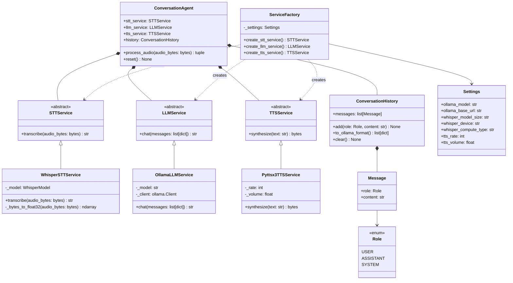

# Class Diagram

```mermaid
classDiagram
    class STTService {
        <<abstract>>
        +transcribe(audio_bytes: bytes) str
    }

    class LLMService {
        <<abstract>>
        +chat(messages: list[dict]) str
    }

    class TTSService {
        <<abstract>>
        +synthesize(text: str) bytes
    }

    class WhisperSTTService {
        -_model: WhisperModel
        +transcribe(audio_bytes: bytes) str
        -_bytes_to_float32(audio_bytes: bytes) ndarray
    }

    class OllamaLLMService {
        -_model: str
        -_client: ollama.Client
        +chat(messages: list[dict]) str
    }

    class Pyttsx3TTSService {
        -_rate: int
        -_volume: float
        +synthesize(text: str) bytes
    }

    class ConversationAgent {
        +stt_service: STTService
        +llm_service: LLMService
        +tts_service: TTSService
        +history: ConversationHistory
        +process_audio(audio_bytes: bytes) tuple
        +reset() None
    }

    class ConversationHistory {
        +messages: list[Message]
        +add(role: Role, content: str) None
        +to_ollama_format() list[dict]
        +clear() None
    }

    class Message {
        +role: Role
        +content: str
    }

    class Role {
        <<enum>>
        USER
        ASSISTANT
        SYSTEM
    }

    class ServiceFactory {
        -_settings: Settings
        +create_stt_service() STTService
        +create_llm_service() LLMService
        +create_tts_service() TTSService
    }

    class Settings {
        +ollama_model: str
        +ollama_base_url: str
        +whisper_model_size: str
        +whisper_device: str
        +whisper_compute_type: str
        +tts_rate: int
        +tts_volume: float
    }

    STTService <|-- WhisperSTTService
    LLMService <|-- OllamaLLMService
    TTSService <|-- Pyttsx3TTSService

    ConversationAgent *-- STTService
    ConversationAgent *-- LLMService
    ConversationAgent *-- TTSService
    ConversationAgent *-- ConversationHistory

    ConversationHistory *-- Message
    Message --> Role

    ServiceFactory --> Settings
    ServiceFactory ..> STTService : creates
    ServiceFactory ..> LLMService : creates
    ServiceFactory ..> TTSService : creates
```
