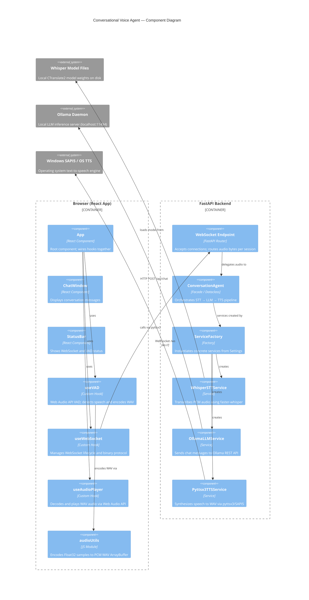

# Component Diagram

```mermaid
C4Component
    title Conversational Voice Agent — Component Diagram

    Container_Boundary(browser, "Browser (React App)") {
        Component(app, "App", "React Component", "Root component; wires hooks together")
        Component(chatWindow, "ChatWindow", "React Component", "Displays conversation messages")
        Component(statusBar, "StatusBar", "React Component", "Shows WebSocket and VAD status")
        Component(vadHook, "useVAD", "Custom Hook", "Web Audio API VAD; detects speech and encodes WAV")
        Component(wsHook, "useWebSocket", "Custom Hook", "Manages WebSocket lifecycle and binary protocol")
        Component(audioPlayer, "useAudioPlayer", "Custom Hook", "Decodes and plays WAV audio via Web Audio API")
        Component(audioUtils, "audioUtils", "JS Module", "Encodes Float32 samples to PCM WAV ArrayBuffer")
    }

    Container_Boundary(backend, "FastAPI Backend") {
        Component(wsEndpoint, "WebSocket Endpoint", "FastAPI Router", "Accepts connections; routes audio bytes per session")
        Component(agent, "ConversationAgent", "Facade / Dataclass", "Orchestrates STT → LLM → TTS pipeline")
        Component(factory, "ServiceFactory", "Factory", "Instantiates concrete services from Settings")
        Component(stt, "WhisperSTTService", "Service", "Transcribes PCM audio using faster-whisper")
        Component(llm, "OllamaLLMService", "Service", "Sends chat messages to Ollama REST API")
        Component(tts, "Pyttsx3TTSService", "Service", "Synthesizes speech to WAV via pyttsx3/SAPI5")
    }

    System_Ext(whisperFiles, "Whisper Model Files", "Local CTranslate2 model weights on disk")
    System_Ext(ollamaDaemon, "Ollama Daemon", "Local LLM inference server (localhost:11434)")
    System_Ext(osTts, "Windows SAPI5 / OS TTS", "Operating system text-to-speech engine")

    Rel(app, vadHook, "uses")
    Rel(app, wsHook, "uses")
    Rel(app, audioPlayer, "uses")
    Rel(vadHook, audioUtils, "encodes WAV via")
    Rel(wsHook, wsEndpoint, "WebSocket /ws", "ws://")

    Rel(wsEndpoint, agent, "delegates audio to")
    Rel(agent, factory, "services created by")
    Rel(factory, stt, "creates")
    Rel(factory, llm, "creates")
    Rel(factory, tts, "creates")

    Rel(stt, whisperFiles, "loads model from")
    Rel(llm, ollamaDaemon, "HTTP POST /api/chat")
    Rel(tts, osTts, "calls via pyttsx3")
```
