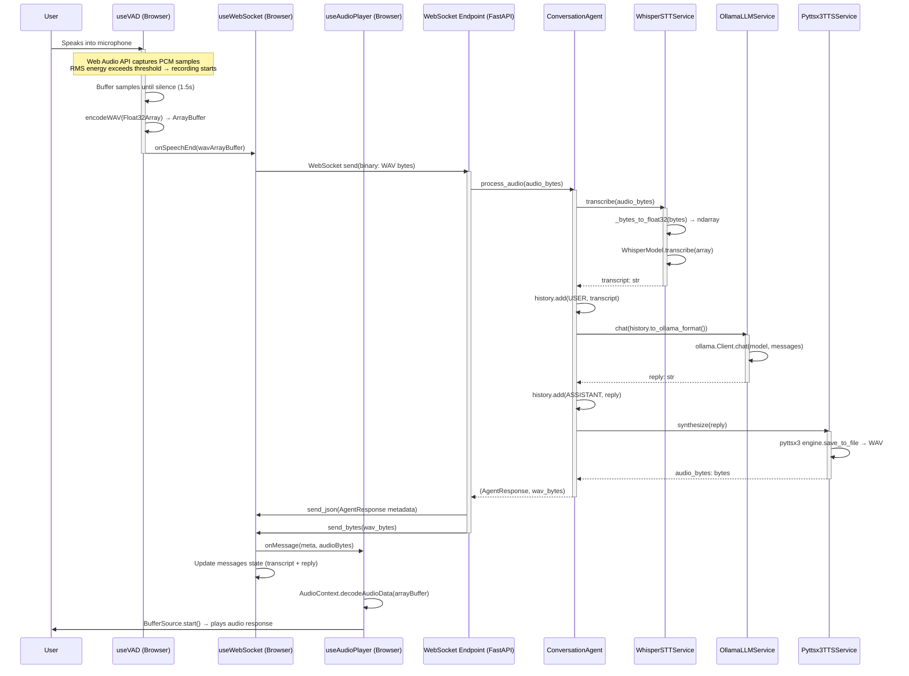

# Flow Diagram

```mermaid
sequenceDiagram
    participant User
    participant VAD as useVAD (Browser)
    participant WS as useWebSocket (Browser)
    participant AP as useAudioPlayer (Browser)
    participant BE as WebSocket Endpoint (FastAPI)
    participant Agent as ConversationAgent
    participant STT as WhisperSTTService
    participant LLM as OllamaLLMService
    participant TTS as Pyttsx3TTSService

    User->>VAD: Speaks into microphone
    activate VAD
    Note over VAD: Web Audio API captures PCM samples<br/>RMS energy exceeds threshold → recording starts
    VAD->>VAD: Buffer samples until silence (1.5s)
    VAD->>VAD: encodeWAV(Float32Array) → ArrayBuffer
    VAD->>WS: onSpeechEnd(wavArrayBuffer)
    deactivate VAD

    WS->>BE: WebSocket send(binary: WAV bytes)
    activate BE

    BE->>Agent: process_audio(audio_bytes)
    activate Agent

    Agent->>STT: transcribe(audio_bytes)
    activate STT
    STT->>STT: _bytes_to_float32(bytes) → ndarray
    STT->>STT: WhisperModel.transcribe(array)
    STT-->>Agent: transcript: str
    deactivate STT

    Agent->>Agent: history.add(USER, transcript)
    Agent->>LLM: chat(history.to_ollama_format())
    activate LLM
    LLM->>LLM: ollama.Client.chat(model, messages)
    LLM-->>Agent: reply: str
    deactivate LLM

    Agent->>Agent: history.add(ASSISTANT, reply)
    Agent->>TTS: synthesize(reply)
    activate TTS
    TTS->>TTS: pyttsx3 engine.save_to_file → WAV
    TTS-->>Agent: audio_bytes: bytes
    deactivate TTS

    Agent-->>BE: (AgentResponse, wav_bytes)
    deactivate Agent

    BE->>WS: send_json(AgentResponse metadata)
    BE->>WS: send_bytes(wav_bytes)
    deactivate BE

    WS->>AP: onMessage(meta, audioBytes)
    WS->>WS: Update messages state (transcript + reply)
    AP->>AP: AudioContext.decodeAudioData(arrayBuffer)
    AP->>User: BufferSource.start() → plays audio response
```
